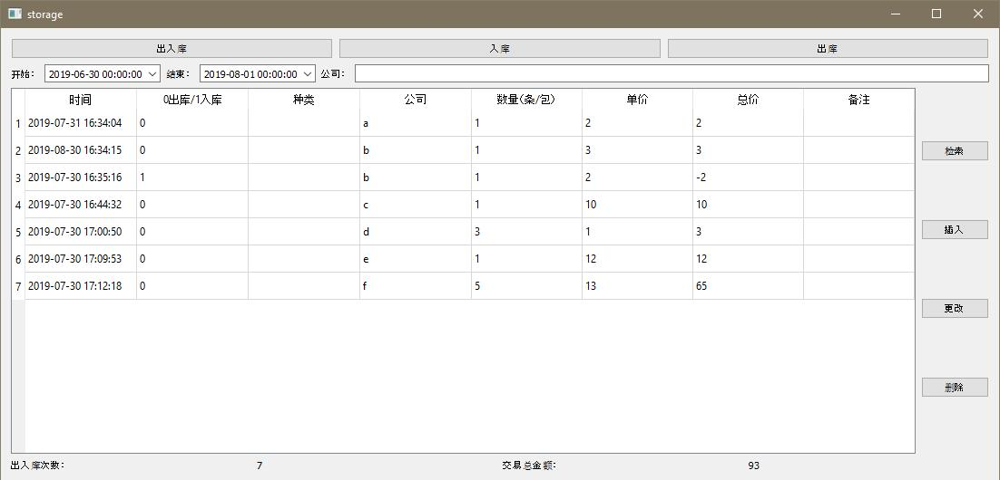
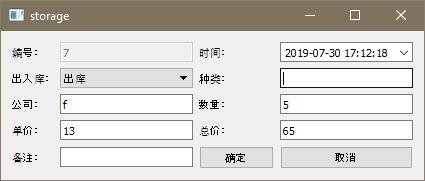

# 出入库管理系统

## 前言

这个程序在月初，也就是7月2号开始写，大约一个月的时间，今天有了一个完整的版本。

作为一个程序员，这种简单的CURD操作相当于大学毕业设计的水平，自己在工作两年之后，才写出来，也算是对自己的一个交代吧。

从17年年底开始自学Qt, 这个程序虽然功能不是很复杂，实用性还是可以的。

## 程序功能

程序UI中的控件布局全部手写，模板也是用的窗口基类widget，重写的消息循环。

整体的设计是使用QSqlTableModel和QTableView模型视图方式，数据库使用SQLite, 设计的初衷是单机运行。

比较复杂的是查询操作，因为涉及到条件查询，比如时间和特定字段的模糊的模糊查询，还有出入库类型的查询。

使用model视图模型比较方便，不需要自己去手写SQL语句，当然，这种比较局限于Qt语言了，不够通用，查询操作都是使用试图模型完成，
模型类中有SetFilter()和Select()以及Submit()，使用起来很简单。

其他的功能添加删除修改，这三个功能是使用SQL实现，也是用的一个大神的封装数据库帮助类。

程序主界面：

插入更新界面：

* 按键功能

    > 出入库： 查询时间段+公司模糊条件

    > 出库： 查询时间段+公司模糊条件+出入库类型为出库0
    
    > 入库： 查询时间段+公司模糊条件+出入库类型为出库1
    
    > 检索： 查询所有记录
    
    > 插入/更改/删除：添加/更改/删除一条记录

## 遇到的问题

1. 写程序的过程感觉像是搭积木，一个个变量函数，组合在一起。
在使用DateTimeEdit控件时，不能初始化控件时间，最后发现是一个:的原因，自己却使用了.当作了对象使用，导致怎么都编译不过去，提示语法错误。

> dateTimeEditBegin->setDate(QDate::currentDate().addMonths(-1));

2. QSqlTableModel的使用
这个类在使用时要和数据库绑定，绑定后不可以关闭数据库，不然也就无法实现相关操作了。

> model = new QSqlTableModel(this, sqliteUtil->m_db);

> model->setTable("Commodity");

> model->select();

delete sqliteUtil; 在程序退出时调用，这样就在程序运行过程中保持数据库是打开状态。

## TODO

程序只是有基础功能，像导出数据到Excel，这些以后有时间再写了。

## End

> GitHub地址： <https://github.com/kiss24/storage>

